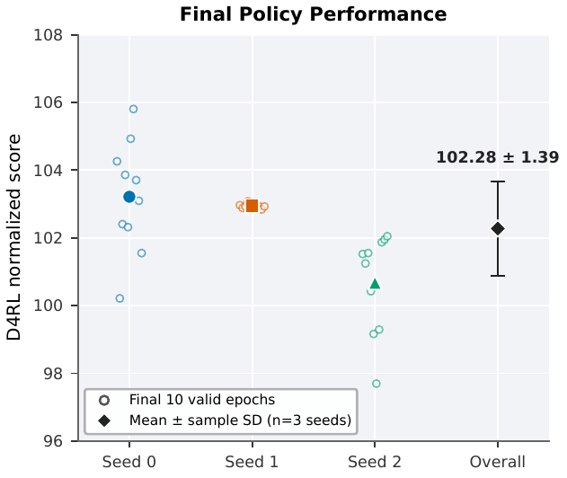
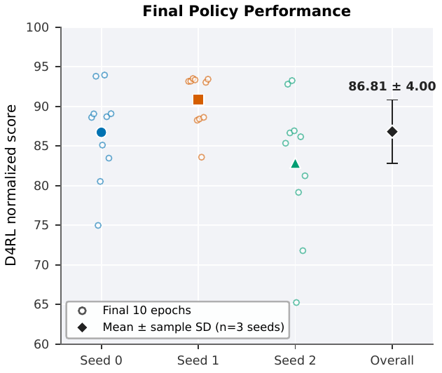
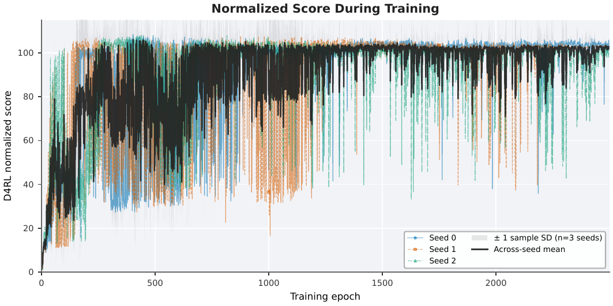
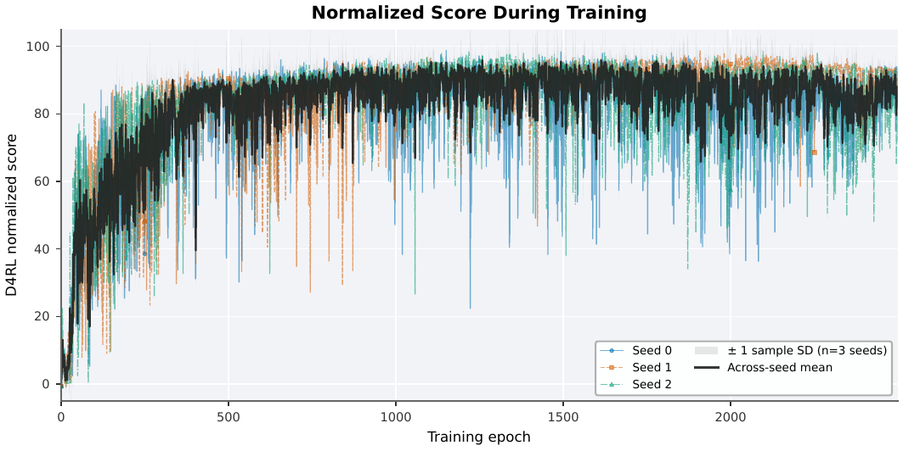
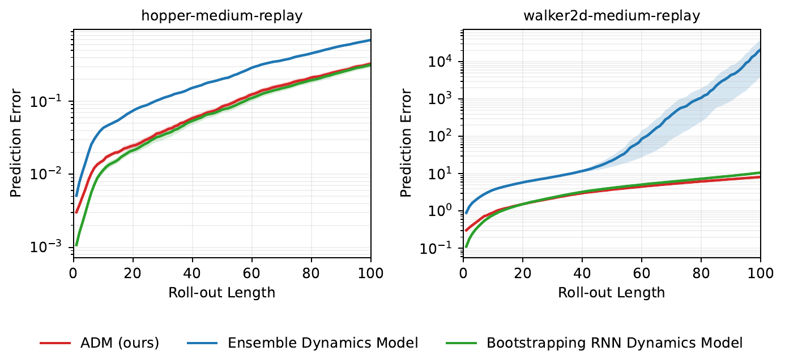
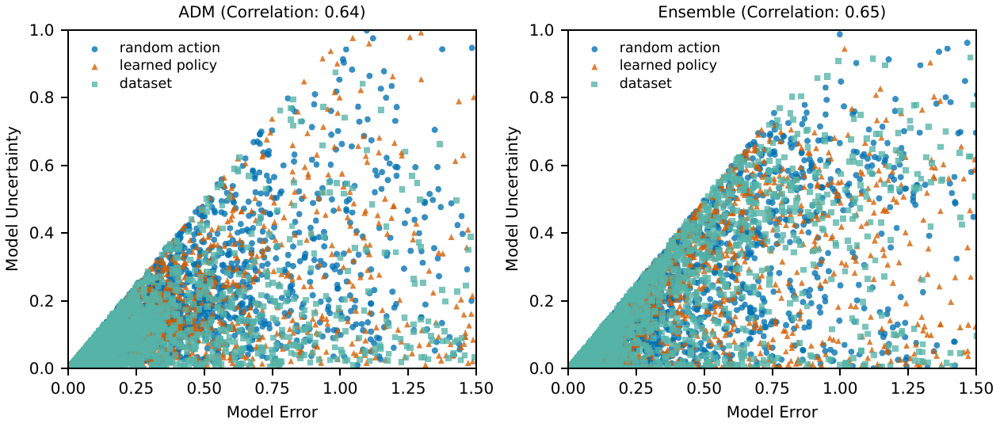

# ADMPO 复现报告：动力学预测与不确定性量化

> 这是一个强化学习论文复现练习。目标不是把论文的全部结论直接视为已经复现，而是建立一条可运行、可检查、可追溯的实验链路，并记录已经实现的部分、尚未实现的部分，以及下一步值得深入的问题。

本文复现 [Any-step Dynamics Model Improves Future Predictions for Online and Offline Reinforcement Learning](https://arxiv.org/abs/2405.17031)（ADMPO）的两个核心现象：

- **Figure 2 类型实验**：ADM、Bootstrapping RNN 与 Ensemble 在长时模型 rollout 中的预测误差增长；
- **Figure 4 类型实验**：在 Hopper 上比较 ADM 与 Ensemble 的模型不确定性和模型误差之间的关系。

## 复现范围

本项目并非对论文全部实验的完整复现。当前范围如下。

| 模块 | 已完成范围 | 不在当前范围内 |
| --- | --- | --- |
| 离线策略跑分 | `hopper-medium-replay-v2`、`walker2d-medium-replay-v2`；ADMPO-OFF；每个环境 3 个随机种子，每种子训练 2,500 个 epoch | 论文完整 12 个 D4RL 任务、5 种子正式统计 |
| 动力学预测（Figure 2） | `hopper-medium-replay-v2`、`walker2d-medium-replay-v2`；ADM / Bootstrapping RNN / Ensemble；每个环境、模型均使用 3 个随机种子 | 在线 ADMPO-ON、完整 D4RL/NeoRL policy score 表、更多任务 |
| 不确定性量化（Figure 4） | `hopper-medium-replay-v2`；ADM / Ensemble；3 个模型种子；5,000 个 Figure 2 test 初始窗口；`H=5`；random / fixed BC / deterministic learned SAC 三类策略 | Walker2d Figure 4、论文作者未公开的原始评估脚本口径 |

论文在 Figure 4 中说明：从 random action、离线训练得到的 policy、以及数据集行为策略三类模型 rollout 中采样 state-action 点，比较 model error 与 model uncertainty；并报告 ADM 的相关系数高于 ensemble，且策略间区分更明显。[论文 §4.3.3](https://arxiv.org/html/2405.17031v1#S4.SS3.SSS3) 但没有公开 Figure 4 的精确 model-error 公式、点的采样方式、相关系数类型或原始评估代码。因此下文的 Figure 4 是根据论文内容进行的尝试。

## 结果概览

### 离线策略跑分：3 种子、2,500 个 epoch

本项目还完成了 ADMPO-OFF 在两个 D4RL medium-replay 环境上的离线策略训练。每个环境独立训练 3 个种子、每种子 2,500 个 epoch；下图的空心点是末 10 个评估 epoch，彩色实心点为各 seed 的末期均值，黑色菱形是跨 seed 的均值与样本标准差。

<table>
  <tr>
    <td width="50%"></td>
    <td width="50%"></td>
  </tr>
  <tr>
    <td align="center">Hopper：末 10 个有效 epoch</td>
    <td align="center">Walker2d：末 10 个 epoch</td>
  </tr>
</table>

| 任务 | 本项目末期 D4RL normalized score（3 seeds，mean ± sample SD） | 论文 ADMPO-OFF（5 seeds） | 判断 |
| --- | ---: | ---: | --- |
| Hopper-medium-replay-v2 | **102.28 ± 1.39** | 104.4 ± 0.4 | 接近论文，但仍略低；3 个种子并不足以替代论文的 5 种子统计 |
| Walker2d-medium-replay-v2 | **86.81 ± 4.00** | 95.6 ± 2.1 | 明显偏低且跨种子不稳定，当前不视为成功复现 |





Hopper 的后期均值稳定在约 102，三个 seed 较为接近。Walker2d 则呈现更明显的两层不稳定性：一是 seed 2 的末期平均约为 82.5，显著低于 seed 0/1；二是单个 epoch 的评估回报具有频繁下探，导致末期 10 个点的样本标准差达到 4.00。它与论文表中 `95.6 ± 2.1` 的 5-seed 结果仍有约 8.8 分的差距。

这部分差距的解释包括：Walker2d 对模型 rollout 和 value target 的误差更敏感、2,500 epoch 下训练尚可能受模型质量和随机优化轨迹影响、以及当前仅 3 个种子的统计精度有限。目前可能的原因有训练轮次不足和ADM环境由于早停机制没有训练的很好。论文的 D4RL 表使用 5 个种子汇总，因此这里仅作方向性比较。[论文 Table 1](https://arxiv.org/html/2405.17031v1#S4.SS3.SSS1)

### 动力学 rollout：Figure 2 类型实验



图中的纵轴为项目评估器输出的 Prediction Error；每个点是在 3 个随机种子、每种子 20 次 rollout 重复下的均值与标准差。实验使用20,000个测试起始窗口和 100 步 rollout。

| 环境 | ADM | Bootstrapping RNN | Ensemble |
| --- | ---: | ---: | ---: |
| Hopper, 100 步 | 0.328 ± 0.040 | 0.317 ± 0.046 | 0.694 ± 0.008 |
| Walker2d, 100 步 | 8.214 ± 0.299 | 10.740 ± 1.142 | 21,387.854 ± 30,213.829 |

在 Hopper 上，ADM 与相同 RNN 主干的 bootstrapping RNN 接近，且二者在 100 步时都低于 ensemble；这并没有完全复现论文中“ADM 始终明显更低”的曲线形态。在 Walker2d 上，ADM 的末端误差低于 RNN，而 ensemble 出现了很强的长时 rollout 发散，三个种子间标准差甚至高于均值。这一现象说明 Walker2d 结果目前并不稳定，不能把单个末端数值当作可靠的模型排序。论文所讨论的核心挑战正是 bootstrap rollout 的误差会随步数累积；本实现确实观察到了该敏感性，但幅度和各模型的相对曲线仍与原文存在差距。[论文 §4.1](https://arxiv.org/html/2405.17031v1#S4.SS1)

对应原始汇总：[`summary.csv`](results/figure2/trajectory_80_10_10_3seeds/stochastic_uniform_k_gaussian_20000starts_20repeats_v3/full/summary.csv)。

### 不确定性量化：Figure 4 类型实验（Hopper）



该图使用所有 **87,843** 个有效原始点：ADM 43,909 个、Ensemble 43,934 个。绘图坐标范围固定为论文 Hopper 面板的 `Model Error ∈ [0, 1.5]`、`Model Uncertainty ∈ [0, 1]`，但图外点不会删除，所有有效点都会参与 CSV 导出和相关性计算。

| Hopper 面板的 pooled Pearson 相关性 | 本项目 | 论文图中报告值 |
| --- | ---: | ---: |
| ADM | 0.640 | 0.98 |
| Ensemble | 0.648 | 0.94 |

本项目的 Spearman 相关性分别约为 ADM 0.962、Ensemble 0.970：主体点的排序关系较强，但少数高误差、低不确定性的 ADM 点会显著压低 Pearson 线性相关。策略水平呈现 **dataset / BC < learned SAC < random action** 的顺序；这说明 random 更容易进入高不确定性区域，但还没有得到论文所强调的“learned policy 最低、ADM 区分更清晰”的效果。

对应原始数据：[`Hopper.csv`](results/figure4/hopper_20260813-131431/Hopper.csv)。

## Figure 4 的复现协议

论文 Eq.4 将不同回溯长度的概率预测视为一个 mixture，并使用预测总方差作为 ADM uncertainty：

```text
U(s, a) = || Var_i[μ_i(s, a)] + E_i[σ_i²(s, a)] ||₁
```

具体流程为：

1. 从 Figure 2 的 held-out test trajectories 中固定抽取 5,000 个初始历史窗口；
2. 对每个 ADM/Ensemble seed，分别以 random action、固定 BC、与对应 seed 的 deterministic SAC actor mean (`tanh(mean)`) 进行 5 步模型 rollout；
3. 在 `H=5` 的 endpoint 上，以 MuJoCo oracle 得到真实下一状态；
4. 对同一 state-action 的五路预测计算横轴误差和 Eq.4 纵轴不确定性；
5. 汇合 3 个模型种子和三种策略的全部有效点，计算相关性，并原样输出 CSV/PDF。

ADM 的 rollout 保持论文算法中的随机回溯思想，`k ∈ {1,…,5}` 在每个模型步均匀采样；论文也说明其 offline Hopper/Walker2d medium-replay 设置为 `m=5, H=5`。[论文 Algorithm 1](https://arxiv.org/html/2405.17031v1#S3) [论文 Appendix D.3](https://arxiv.org/html/2405.17031v1#S4.SS4)

## 与论文差距的初步分析

- **Figure 4 的口径仍有不可消除的公开信息缺口。** 论文没有给出横轴 model error 的公式，也没有公开点是否取每一步、轨迹末端、是否归一化、如何做相关性聚合。即使 Eq.4 已明确，横轴和采样的差异可能会改变 Pearson。
- **当前 ADM 存在共同偏差。** 五个回溯来源可能在同一 state-action 上同时偏离真实状态；这种误差不会由来源间分歧充分反映，于是会产生“高 model error、低 Eq.4 uncertainty”的点。它可能是ADM相关性没有升到论文0.98的主要可见现象。
- **策略分布不一定符合论文要求。** 本项目的 dataset policy 是固定 BC 代理，而不是直接重放每条数据集动作；learned policy 使用与 ADM seed 对应的 SAC actor mean。它们是可复现的控制变量，但仍可能与论文的 behavior policy 和训练细节不同，从而弱化三种策略的间隔。
- **Figure 2 的 Walker2d 仍不稳定。** 从曲线图来看可能由于训练轮次不足够，导致训练过程并未能够收敛。
- **Walker2d 的策略分数尚未实现。** 当前 86.81 ± 4.00 低于论文 95.6 ± 2.1，且最弱种子拖低末期均值。这与 Figure 2 中 Walker2d 长时模型 rollout 更敏感的观察一致。

## 下一步可以尝试的点

1. 将 Figure 4 的 error 计算、采样点和相关性聚合逐项做对照实验。
2. 对于walker2d按照原论文规模进行训练。
3. 若能获得作者的评估实现或更详细的实验记录，再对齐 Figure 4 的隐藏细节。

我把这个项目作为一次训练尝试：不仅复现图形，也理解复现失败时究竟是实现、协议还是模型本身的问题。当前结果仍有明显差距，但这些差距提供了具体且可验证的后续研究方向；我愿意在进一步学习和获得指导后持续改进。

## 运行 Figure 4

Figure 4 的统一入口为：

```bash
python -m admpo_repro run figure4
```


命令固定使用 `cuda:0`、Hopper、3 个模型种子、5,000 个窗口与 `H=5`。最终目录只保留原始散点 CSV 和最终 PDF。
