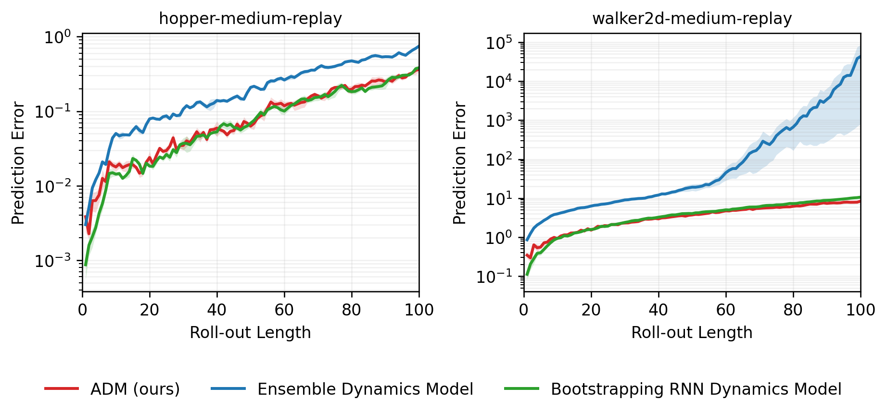

# ADMPO Figure 2 与 Figure 4 部分复现

本项目复现论文 *Any-step Dynamics Model Improves Future Predictions for Online and Offline Reinforcement Learning* 的 Figure 2（长期动力学预测误差）与 Figure 4（模型误差—不确定性相关性）。目标是复现论文的主要趋势与结论，不追求数值或图像像素级一致。

## 当前状态

| 实验 | 当前口径 | 状态 | 说明 |
|---|---|---|---|
| Figure 2 诊断版 | 2任务、3种子、1000固定窗口、每窗口1次随机 rollout | 已完成 | 用于验证随机 `k` 与高斯采样修正，结果保留但不作为最终高统计量版本 |
| Figure 2 最终版 | 2任务、3种子、20000固定窗口、每窗口20次随机 rollout | 代码与测试已完成，尚未运行 | 独立 v3 命名空间；不会覆盖诊断版 |
| Figure 4 | Hopper、2种子、3000 epochs | 本地正式训练中 | 从两个种子的1250-epoch检查点恢复；旧预算目录只归档 |

本文档只报告已经实际产生的结果。Figure 2 v3 和 Figure 4 完成前，对应表格明确标记为“待运行”，不会预填或推测实验结果。

## 复现范围

### Figure 2

- 数据集：`hopper-medium-replay-v2`、`walker2d-medium-replay-v2`。
- 模型：ADM、Bootstrapping RNN、7成员/5 elite Ensemble。
- 训练种子：`0, 1, 2`。
- 数据按完整 episode 划分为训练/验证/测试集，目标比例为 `80%/10%/10%`，划分种子为 `202405`。
- 三类模型共享数据划分；所有训练种子、模型和随机重复共享同一组测试窗口。
- 测试动作直接使用对应 D4RL 轨迹中记录的真实动作，不训练 BC，不调用 MuJoCo oracle。
- 最终曲线以3个训练种子为统计单位，阴影为跨种子 SEM；20次随机 repeat 在每个种子内部汇总，绝不当成额外种子。

### Figure 4

- 任务：`hopper-medium-replay-v2`。
- 策略训练种子：`0, 1`。
- 比较 ADM 与 Ensemble 在随机动作、学习策略和测试集动作三种分布下的误差—不确定性相关性。
- 当前预算为3000 epochs；原计划5000 epochs未完整执行，最终 README 会明确标注这一计算预算偏差。

### 未复现内容

本项目不复现在线学习实验、完整 D4RL/NeoRL 性能表、附录全部消融、其余动力学基线及论文所有任务。当前结果属于明确缩小范围的部分复现。

## Figure 2 最终评估口径（v3）

### 固定测试窗口

- 每个任务从测试 episode 中按 `window_seed=202405` 无放回抽取20000个连续窗口。
- 每个窗口包含5步初始历史、未来100步真实动作和对应真实未来状态。
- 窗口不会跨越 episode 边界；若测试集不足20000个有效窗口，程序直接失败，不会通过有放回采样制造重复窗口。
- “20000个窗口”不等于“20000个不同 episode”：不同窗口可能来自同一个测试 episode，也可能在时间上重叠。

### 20次独立随机 rollout

每个任务、训练种子、模型和固定窗口执行20次完整的100步随机 rollout：

1. 每个 repeat 都从同一真实初始历史重新开始。
2. ADM 与 RNN 在同一训练 seed、同一 repeat 中共享完全相同的随机 `k` 序列；每一步从 `1,…,m` 均匀抽取一个标量 `k`，整批窗口共用该步的 `k`。
3. 不同 repeat 使用独立且可复现的 `k` 流和高斯噪声流；基础 `rollout_seed=202406`。
4. ADM 和 RNN 都从模型输出的高斯分布采样下一状态，而不是使用预测均值。
5. Ensemble 对每条窗口、每一步重新选择一个 elite，并从该 elite 的高斯分布采样下一状态。
6. 模型预测状态递归反馈给自身；真实状态只作为同一步误差目标，不做 teacher forcing。
7. 20000个窗口按最多4096条分块推理，但同一步所有分块共用同一个 `k`，分块不改变实验随机语义。

每个 repeat 的曲线写入 `per_repeat/`；随后在同一训练 seed 内对20次 repeat 和20000个窗口做池化，生成唯一的 `per_seed/` 曲线。中断后使用 `--resume` 时，程序只复用已经写满100个 horizon 行的完整 model-repeat 组，不复用残缺组。

### 指标与统计

- 单点误差：预测状态与数据集真实未来状态在原始状态维度上的 MSE。
- 每个 seed 的 `error_mean`：20次 repeat × 20000窗口的池化均值。
- `repeat_mean_std/sem`：20条 repeat 均值曲线的随机 rollout 波动，仅作诊断。
- 主图均值和阴影：3个训练 seed 的均值与 SEM；repeat 不参与 `n_seeds`。
- NaN、Inf 或超过 float32 上限的误差按配置截断并如实保留，不删除发散轨迹。

## 模型与训练配置

### ADM 与 Bootstrapping RNN

- 3层 GRU，隐藏维度200，4个残差块，最大回溯长度 `m=5`。
- batch size 256，Adam 学习率 `3e-4`。
- 每次训练更新都从 `k∈{1,…,5}` 均匀随机采样；ADM 与 RNN 获得相同数量的优化器更新。
- ADM 从起始状态与动作子序列预测任意步状态增量；RNN 从逐状态—动作历史预测下一状态。
- 验证阶段分别计算全部 `k=1,…,5` 的误差，测试集不参与早停或模型选择。

### Ensemble

- 7个成员，选择验证误差最低的5个 elite。
- 每个成员为4×200 Swish MLP，使用独立 bootstrap 采样和早停。

所有 Figure 2 最终评估均复用已经训练完成的18个检查点，不因窗口数或 repeat 数变化而重新训练模型。

## Figure 4 当前口径

- ADMPO-OFF：`m=5`、模型 rollout horizon 5、惩罚系数0.1、real ratio 0.5、固定 `alpha=0.05`。
- actor/critic：2×256；每 epoch 1000次更新；总预算3000 epochs。
- 两个 seed 并行训练，并从各自1250-epoch检查点恢复；余弦调度器仍保留原5000-epoch调度长度，避免改变已经完成部分的优化轨迹。
- 主误差：从共同真实初始状态出发后的累计轨迹 raw-state RMSE。
- 主不确定性：不同回溯预测均值（ADM）或同一当前模型状态—动作下 elite 预测均值（Ensemble）的 RMS 分歧。
- 三类动作：动作空间均匀随机、确定性 ADMPO 学习策略、连续测试窗口中的 D4RL 数据集动作。
- 真实下一状态由 MuJoCo oracle 在当前模型状态处重建；局部一步误差和总方差指标作为附加诊断保存。

## 环境与硬件

### 本地 WSL

- WSL：`Ubuntu-22.04-Recovery`
- Conda 环境：`admpo`
- Python 3.9、PyTorch 2.0.1+cu118
- D4RL 1.1、Gym 0.23.1、mujoco-py 2.1.2.14
- GPU：RTX 4060 Laptop 8 GB

### RTX 5090 Figure 2 评估环境

- Ubuntu 22.04、Python 3.10.20
- PyTorch 2.8.0+cu128、NumPy 1.26.3、h5py 3.10.0、Matplotlib 3.8.2
- GPU：RTX 5090 32 GB；驱动580.105.08；CUDA 12.8

环境差异和完整包版本由每次运行 manifest 记录。Figure 2 只直接读取缓存 HDF5，不依赖 MuJoCo；Figure 4 必须使用本地 MuJoCo 环境。

## 数据集与哈希

数据默认放在 `~/.d4rl/datasets/`，不进入 Git。

| 数据集文件 | 字节数 | SHA256 |
|---|---:|---|
| `hopper_medium_replay-v2.hdf5` | 75,854,457 | `e121c5f7c9857a307baa9edc6a2c3b48e85fedb9ac316ecddd0f48ca7ef4e39b` |
| `walker2d_medium_replay-v2.hdf5` | 86,323,963 | `e75de96a4f77acf7d4e0d6fdf0d7ccb177c26c44bb4388e4fd99f543ccfa18db` |

## 安装与检查

```bash
git submodule update --init --recursive
python -m pip install -e . --no-deps
python -m pytest -q
python -m admpo_repro check --phase full
```

`vendor/ADMPO` 固定到提交 `68c28b9bbf6b95a801ebb30ea47294ad2d8d9cb3`。

## 运行命令

### Figure 2

低成本端到端 smoke（8窗口、2 repeats、5步）：

```bash
python -m admpo_repro run figure2 --phase smoke --seeds 0 --workers 1 --resume
```

远端 pilot（Hopper seed 0、1000窗口、2 repeats）：

```bash
python -m admpo_repro run figure2 --phase pilot --seeds 0 --workers 1 --resume
```

正式 v3 评估（20000窗口、20 repeats、3种子；已有检查点全部复用）：

```bash
python -m admpo_repro run figure2 --phase full --seeds 0 1 2 --workers 3 --resume
```

从 `per_seed` CSV 重绘：

```bash
python -m admpo_repro plot figure2 --phase full
```

### Figure 4

```bash
python -m admpo_repro run figure4 --phase full --seeds 0 1 --workers 2 --resume
python -m admpo_repro plot figure4 --phase full
```

## 结果与目录

### Figure 2 已完成诊断版（1000窗口 × 1 repeat）



step 100 的三种子均值：

| 任务 | ADM | RNN | Ensemble | 判断 |
|---|---:|---:|---:|---|
| Hopper-medium-replay-v2 | **0.3643** | 0.3829 | 0.7479 | ADM均值最低，但仅比RNN低约4.9%，分离较弱 |
| Walker2d-medium-replay-v2 | **8.3975** | 10.6484 | 42915.6254 | ADM明显更低；Ensemble随机 rollout 严重发散 |

Hopper 的 ADM/RNN 曲线多次交叉，且 seed 2 的 step-100 ADM 略差于 RNN，因此诊断版只支持“平均趋势复现”，不能表述为稳定、显著优势。Walker2d 的 Ensemble 结果具有明显重尾和种子敏感性，项目保留原始结果，不筛选种子或缩放图像掩盖发散。

诊断版提交：`810cbcc`；生成它的评估代码与配置提交：`c31ee88c8c6cdbb7ff1e5920bc89621c9fed8c47`。

### Figure 2 v3 最终版（20000窗口 × 20 repeats）

状态：**尚未运行**。预期输出：

```text
results/figure2/trajectory_80_10_10_3seeds/
└── stochastic_uniform_k_gaussian_20000starts_20repeats_v3/full/
    ├── per_repeat/     # 每个任务—seed的20次随机曲线
    ├── per_seed/       # repeat池化后的每seed曲线，主图只读取这里
    ├── summary.csv     # 3个训练seed的均值、标准差和SEM
    ├── figure2.png
    └── figure2.pdf
```

对应 manifest：

```text
results/manifests/figure2-trajectory_80_10_10_3seeds-stochastic_uniform_k_gaussian_20000starts_20repeats_v3-full.json
```

正式结果完成后，本节将补充实测耗时、step-100表格、repeat稳定性和与诊断版/论文趋势的对照。

### Figure 4

当前运行目录：

```text
runs/figure4/cumulative_rmse_std_hopper_2seeds_3000epochs/formal/
```

预期结果目录：

```text
results/figure4/cumulative_rmse_std_hopper_2seeds_3000epochs/full/
```

训练完成后将补充相关性表、散点图、每个 seed 的 Pearson `r`、均值±标准差及是否复现论文结论。

## 仓库结构

```text
admpo-reproduction/
├── README.md
├── THIRD_PARTY.md
├── configs/
├── src/admpo_repro/
│   ├── data/
│   ├── dynamics/
│   ├── evaluation/
│   ├── plotting/
│   └── policies/
├── tests/
├── results/
│   ├── figure2/
│   ├── figure4/
│   └── manifests/
├── runs/                 # 检查点与运行日志，Git忽略
└── vendor/ADMPO/         # 固定官方子模块
```

模型检查点、TensorBoard日志、原始轨迹和 D4RL 数据集不提交 Git；PNG/PDF、聚合 CSV、必要的 repeat 诊断 CSV 和 manifest 可以提交。

## 可复现性与已知限制

- Python、NumPy、PyTorch CPU/CUDA、数据划分、窗口抽样、`k`、高斯噪声和 elite 选择均由记录的种子控制。
- Figure 2 v3 的计算量约为诊断版的400倍；正式运行前先执行 pilot，并根据实测吞吐更新预计时间。
- 20000窗口可能相互重叠，因此窗口级 SEM 不能解释为20000条独立 episode 的统计显著性；主图只使用跨训练 seed SEM。
- 3个训练 seed 少于原始五种子计划，跨 seed 不确定性估计仍较弱。
- 论文与官方仓库没有公开完整 Figure 2 基线训练/评估脚本；RNN、Ensemble及部分训练细节参考同作者 ADM-v2 与 OfflineRL-Kit 重建。
- PyTorch 2.8.0 是 RTX 5090 兼容性带来的环境偏差；本地 WSL 继续用 PyTorch 2.0.1 验证接口兼容。
- Figure 4 采用3000而非5000 epochs，最终结论必须按缩减预算解释。

第三方版本、固定提交及借鉴关系见 [THIRD_PARTY.md](THIRD_PARTY.md)。
